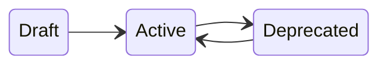

# Advanced Topics

This document covers advanced features of the `Skyline.DataMiner.Solutions.PeopleAndOrganizations` API including state management, logging, and installation checks.

## State Management

People, teams, and organizations follow a lifecycle with three states: **Draft**, **Active**, and **Deprecated**.

### Person State Transitions



People are created in the **Draft** state. Once fully configured, they can be transitioned to **Active** state. An active person can be **Deprecated** when they are no longer available, and restored back to **Active** if required again.

```csharp
using Skyline.DataMiner.Solutions.PeopleAndOrganizations.API;
using Skyline.DataMiner.Solutions.PeopleAndOrganizations.Automation;

var api = engine.GetPeopleAndOrganizationsApi();

// Create a person (starts in Draft state)
var person = api.People.Create(new Person
{
    Name = "John Doe",
    Email = "john.doe@example.com",
});
// person.State == PersonState.Draft

// Transition to Active
var activated = api.People.Activate(person);
// activated.State == PersonState.Active

// Transition to Deprecated
var deprecated = api.People.Deprecate(person);
// deprecated.State == PersonState.Deprecated

// Restore from Deprecated back to Active
var restored = api.People.Activate(person);
// restored.State == PersonState.Active
```

### Batch Person State Transitions

State transitions can be performed on multiple people at once:

```csharp
using Skyline.DataMiner.Solutions.PeopleAndOrganizations.API;
using Skyline.DataMiner.Solutions.PeopleAndOrganizations.Automation;

// Activate multiple people
var activatedPeople = api.People.Activate(new[] { person1, person2, person3 });

// Deprecate multiple people
var deprecatedPeople = api.People.Deprecate(new[] { person1.Id, person2.Id });
```

### Team State Transitions

Teams follow the same Draft/Active/Deprecated lifecycle:

```csharp
using Skyline.DataMiner.Solutions.PeopleAndOrganizations.API;
using Skyline.DataMiner.Solutions.PeopleAndOrganizations.Automation;

// Activate a team
var activated = api.Teams.Activate(team);

// Deprecate a team
var deprecated = api.Teams.Deprecate(team);

// Restore a team
var restored = api.Teams.Activate(team);
```

### Batch Team State Transitions

```csharp
using Skyline.DataMiner.Solutions.PeopleAndOrganizations.API;
using Skyline.DataMiner.Solutions.PeopleAndOrganizations.Automation;

// Activate multiple teams
var activatedTeams = api.Teams.Activate(new[] { team1, team2 });

// Deprecate multiple teams
var deprecatedTeams = api.Teams.Deprecate(new[] { team1.Id, team2.Id });
```

### Organization State Transitions

Organizations follow the same lifecycle:

```csharp
using Skyline.DataMiner.Solutions.PeopleAndOrganizations.API;
using Skyline.DataMiner.Solutions.PeopleAndOrganizations.Automation;

// Activate an organization
var activated = api.Organizations.Activate(organization);

// Deprecate an organization
var deprecated = api.Organizations.Deprecate(organization);

// Restore an organization
var restored = api.Organizations.Activate(organization);
```

### Batch Organization State Transitions

```csharp
using Skyline.DataMiner.Solutions.PeopleAndOrganizations.API;
using Skyline.DataMiner.Solutions.PeopleAndOrganizations.Automation;

// Activate multiple organizations
var activatedOrgs = api.Organizations.Activate(new[] { org1, org2 });

// Deprecate multiple organizations
var deprecatedOrgs = api.Organizations.Deprecate(new[] { org1.Id, org2.Id });
```

## Bookable Teams

In addition to the Draft/Active/Deprecated lifecycle, teams can be marked as bookable to indicate that they can be reserved or scheduled.

```csharp
using Skyline.DataMiner.Solutions.PeopleAndOrganizations.API;
using Skyline.DataMiner.Solutions.PeopleAndOrganizations.Automation;

var api = engine.GetPeopleAndOrganizationsApi();

// Make a team bookable
var bookableTeam = api.Teams.MakeBookable(team);
// bookableTeam.IsBookable == true

// Make multiple teams bookable
var bookableTeams = api.Teams.MakeBookable(new[] { team1, team2 });
```

> [!NOTE]
> A team must be in **Active** state before it can be made bookable.

## Logging

The API supports custom logging through the `ILogger` interface.

### Setting a Logger

```csharp
using Skyline.DataMiner.Solutions.PeopleAndOrganizations.Automation;
using Skyline.DataMiner.Solutions.PeopleAndOrganizations.Logging;

var api = engine.GetPeopleAndOrganizationsApi();

// Set a custom logger
api.SetLogger(myLogger);
```

## Installation and Setup

### Checking Installation Status

Verify that the People and Organizations application is installed:

```csharp
using Skyline.DataMiner.Solutions.PeopleAndOrganizations.Automation;

var api = engine.GetPeopleAndOrganizationsApi();

if (!api.IsInstalled())
{
    // Application is not installed
}
```

### Getting the Installed Version

Retrieve the version of the installed application:

```csharp
using Skyline.DataMiner.Solutions.PeopleAndOrganizations.Automation;

var api = engine.GetPeopleAndOrganizationsApi();

if (api.IsInstalled(out string version))
{
    Console.WriteLine($"People and Organizations Version: {version}");
}
```

## Next Steps

- **[Quick Reference](Quick%20Reference.md)** – Common snippets for repositories, querying, and object management
- **[Getting Started](Getting%20Started.md)** – Installation and basic usage
